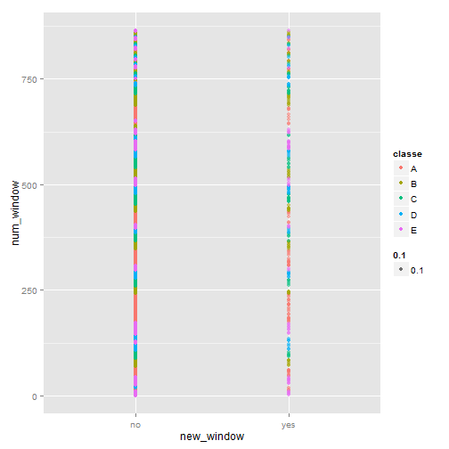
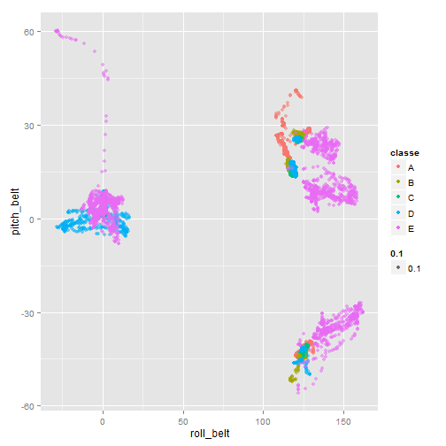
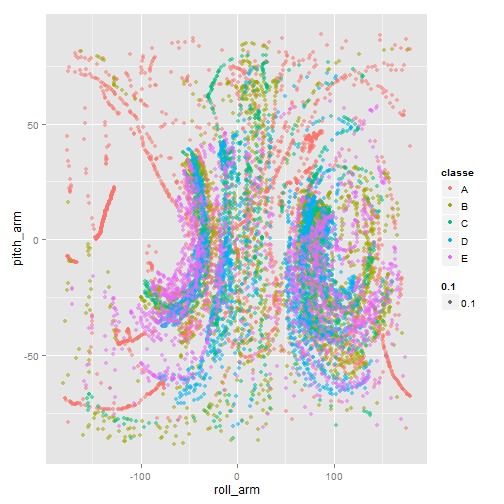
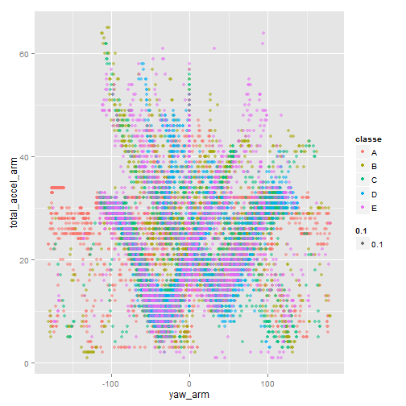

Predict Five Types of Exercise
========================================================

## Summary
Using devices such as Jawbone Up, Nike FuelBand, and Fitbit it is now possible to collect a large amount of data about personal activity relatively inexpensively. One thing that people regularly do is quantify how much of a particular activity they do, but they rarely quantify how well they do it. 
In this analysis, we choose 18 variables to predict which exercise they do, 
and train using random forest method.
We find that the expected error rate is about 0.3% in test sample.
Therefore, we conclude that we can predict which exercise they do.


## Analysis
First, we download file via the following command (it just be done once, 
so commented):

```r
#download.file("https://d396qusza40orc.cloudfront.net/predmachlearn/pml-training.csv", destfile="pml-training.csv", method="curl");
#download.file("https://d396qusza40orc.cloudfront.net/predmachlearn/pml-testing.csv", destfile="pml-testing.csv", method="curl");
```

Settings for this analysis. Loading libraries & setting my functions.

exp_input() takes a vector of string that each element is explanatory variables, 
and return a string combining by "+" signs.

missClass() takes two arguments, one is the label which outcome is, and 
the other is the label predicted by some models.

```r
library(caret)
```

```
## Warning: package 'caret' was built under R version 3.1.1
```

```
## Loading required package: lattice
```

```
## Warning: package 'lattice' was built under R version 3.1.1
```

```
## Loading required package: ggplot2
```

```
## Warning: package 'ggplot2' was built under R version 3.1.1
```

```r
exp_input <- function(x){
  res = x[1];
	for (i in 2:length(x)){
			res <- paste(res, " + ", x[i], sep="");
	}
	return(res);
}

missClass <- function(values, prediction){
  sum( prediction != values )/length(values)
}
```

Loading data. 
We prepare 3 data: One is training dataset used for creating models.
Next we set cross-validation dataset to estimate error rate 
produced by our models.
The ratio between training & cross-validation dataset is 6:4.
And we also prepate testing dataset to predict which outcome is.

```r
  raw_training <- read.csv("pml-training.csv");
  testing  <- read.csv("pml-testing.csv");
  
  set.seed(1)
  inTrain <- createDataPartition(y=raw_training$classe,p=0.6, list=F)
  training <- raw_training[inTrain, ]
  cv       <- raw_training[-inTrain, ]
```

Then, we look at some variables in two-dimensional space.
To do this, we determine explanatory variables in this analysis.
Here, we demonstrate just 4 plotting.

```r
  p <- qplot(new_window, num_window, col=classe, data=training, alpha=0.1);
  p # plot 1
```

 

```r
  p <- qplot(roll_belt, pitch_belt, col=classe, data=training, alpha=0.1);
  p # plot 2
```

 

```r
  p <- qplot(roll_arm, pitch_arm, col=classe, data=training, alpha=0.1);
  p # plot 3
```

 

```r
  p <- qplot(yaw_arm, total_accel_arm, col=classe, data=training, alpha=0.1);
  p # plot 4
```

 

From this plotting analysis, we adopt the following variables as explanatory variables:


```r
  input_vars_list <- c("new_window", "num_window", "roll_belt", "pitch_belt", "yaw_belt", 
    "total_accel_belt", "roll_arm", "pitch_arm", "yaw_arm", "total_accel_arm", 
  	"roll_dumbbell", "pitch_dumbbell", "yaw_dumbbell", "total_accel_dumbbell",
  	"roll_forearm", "pitch_forearm", "yaw_forearm", 
  	"total_accel_forearm");
```


Using the explanatory variables, we create models by random forest.

```r
input_vars <- exp_input(input_vars_list)

set.seed(2);

st <- Sys.time();
modFit <- train( eval(parse(text=paste("classe ~", input_vars, sep="")))
  ,data=training, method="rf")
```

```
## Loading required package: randomForest
```

```
## Warning: package 'randomForest' was built under R version 3.1.1
```

```
## randomForest 4.6-10
## Type rfNews() to see new features/changes/bug fixes.
```

```
## Warning: package 'e1071' was built under R version 3.1.1
```

```r
ed <- Sys.time();
st - ed;
```

```
## Time difference of -18.11 mins
```

## Results
After creating our model, we check error rate both training and 
cross-validation dataset.
The error rate is approximately 0.3% in cross-validation dataset. 

```r
# error rates
# -- training dataset
missClass(training$classe, predict(modFit, training))
```

```
## [1] 0
```

```r
# -- cross-validation dataset
missClass(cv$classe, predict(modFit, cv))
```

```
## [1] 0.002549
```

Using our model, we predict labels in test samples.
The outputs are written in each files (total 20 files are created).

```r
# test sample
answers <- predict(modFit, testing)
pml_write_files = function(x){
  n = length(x)
  for(i in 1:n){
    filename = paste0("problem_id_",i,".txt")
    write.table(x[i],file=filename,quote=FALSE,row.names=FALSE,col.names=FALSE)
  }
}
pml_write_files(answers)
```


